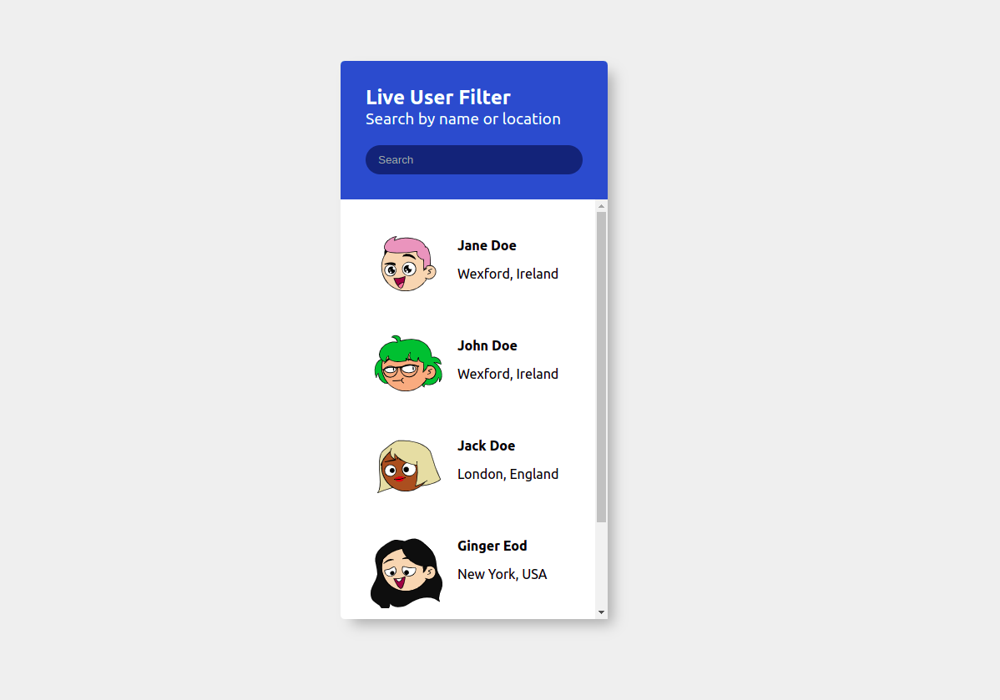

# Users List

Mini apka edukacyjna - aplikacja wyświetla listę userów na podstawie tablicy obiektów - obiekt jest reprezentacją usera.

Podgląd live aplikacji dostepny pod tym linkiem: http://users-list.surge.sh/

## Uruchomienie aplikacji

Po sklonowaniu repozytorium należy wykonać następujące kroki:

- instalacja zależności (npm install)
- uruchomienie aplikacji (npm start)

### Zadanie

Twoim zadaniem jest dokończenie aplikacji zgodnie z podanymi informacjami (gif, designy oraz opis)

Aplikacja wyświetla listę userów na podstawie tablicy obiektów: pierwszym Twoim zadaniem jest analiza aplikacji/istniejącego kodu tak żeby zrozumieć co z czym się łączy i co od czego zależy. Aplikacja jest pozbawiona funkcjonalnosci filtrowania userów za pomocą search bara - jest to Twoje główne zadanie do wykonania!

Żeby to wykonać musisz dostosować kod będący w pliku App.js

### Plik App.js i to na co należy zwrócić uwagę:

- komponent UsersList przyjmuje props users który wyswietla przekazaną listę - jeżeli przekażesz pustą tablice aplikacja nic nie wyświetli, jeżeli zakomentujesz któregoś z userów aplikacja również go pominie - musisz w jakiś sposób przekazywać tutaj odfiltrowanych userów
- zwróć uwagę na funkcję handleSearchPhraseChange - co ona robi gdzie jest przekazywana i w jakim momencie jest wywoływana, sprawdź czym jest parametr searchPhraseInput
- obecny stan aplikacji nie jest zgodny z designem

### wskazówki

- dużo consoluj (console.log())
- żeby odfiltrować listę userów musisz skorzystać z metody dostępnej na tabicach: filter
- dużo consoluj (console.log())
- przefiltrowaną tablicę należy przekazać do komponentu UsersList za pomocą propsa users
- dużo consoluj (console.log())
- w plikach oznaczonych słowem solution są modelowe rozwiazania zadania - korzystaj w ostateczności :)

a i dużo consoluj :p

### Design

### Przykładowe działanie

